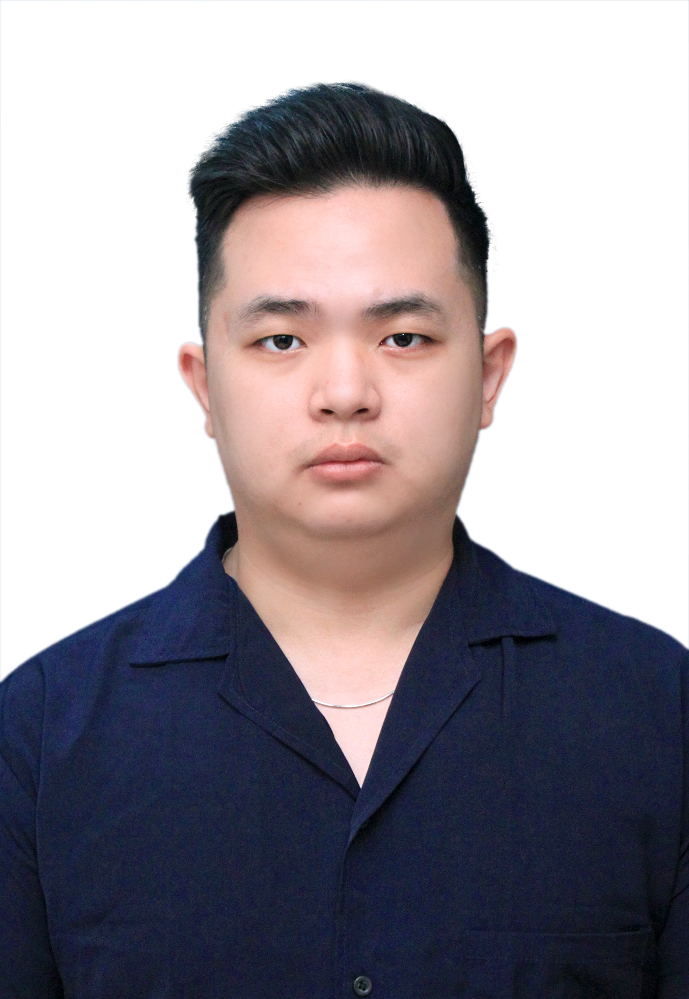

# Adrian Ken

# Education
- Bachalor Degree: Industrial Engineering (Parahyangan Catholic University)
- Master Degree: Global Master of Business Administration (Tunghai University)
# Working Experience

- Part Time: 
1. "Kopi Buat Kamu" Coffee Shop (Barista)
2. Old Ben's Cafe (Junior Barista)

- Full Time:
1. CV. Best Offset (Digital Marketing)
2. PT. Riau Andalan Pulp and Paper (Logistic Planner)

# Skills
- Microsoft Office Skills
- Fluent in both Indonesian and English
- Experience with ERP system(s)
- Team player
- Convincing, pro-active and “can do” mentality
